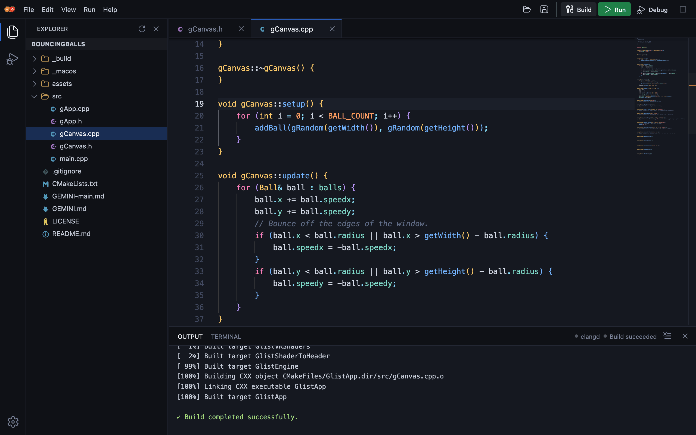

# Glist Studio

Glist Studio is a lightweight desktop IDE for Glist Engine projects, built with Electron and TypeScript.



## Features

- Project explorer with file operations, and the engine and plugins the project uses, to browse and edit
- C/C++ editor powered by Monaco, with code intelligence from clangd: diagnostics, completion, go to definition, references, rename, quick fixes and formatting
- Build, run and stop with live output, where file locations open the file at that line; the program's arguments and environment variables are set in Settings
- With Show all targets on in Settings, a list beside Run of every CMake target, the engine's and plugins' too, as CLion has; Build, Run and Debug use the one chosen
- A debugger with breakpoints, stepping, variables and the call stack
- A terminal in the project folder, with the same tools on `PATH` as builds
- Git, off until turned on, laid out as in JetBrains IDEs: a Commit view, diffs in the editor, the log and its graph, branches, remotes, stashes, blame and conflict resolution, also for the engine's and plugins' own repositories, with pushed commits and protected branches kept from being rewritten
- Coding agents (Claude Code, Codex, Gemini CLI, Antigravity) in an Agent tab, off until turned on
- A Plugins view listing GlistPlugins' plugins: one click installs one into `glistplugins`, another adds it to the project, and updates from GlistPlugins are offered as they come, keeping any work of your own on a stash or a branch
- Automatic CMake source-list updates when files are created, renamed, or removed
- CMake configures again on its own when a CMake file changes, so code intelligence follows new files and plugins without a build
- C++ class generation with matching header and source files
- New projects from the bundled GlistApp, GlistConsoleApp and GlistGUIApp templates
- Installing Glist Engine itself, with its own installer, when it is missing
- English and Turkish, themes including imported VS Code themes, font choices, and a scale setting up to 300% for projectors

## Installing

Each release carries a universal `.dmg` for macOS, a setup `.exe` for Windows on x64 and arm64, and an AppImage for Linux on x86_64 and aarch64. The builds are not signed yet, so each system asks once:

- macOS: right-click the app and choose Open, or run `xattr -dr com.apple.quarantine "/Applications/Glist Studio.app"`.
- Windows: SmartScreen shows "Windows protected your PC"; choose More info, then Run anyway.
- Linux: make the AppImage executable (`chmod +x`) and run it. It runs natively on Wayland when the session sets `XDG_SESSION_TYPE=wayland`, as Hyprland does; elsewhere pass `--ozone-platform=wayland`. On tiling compositors such as Hyprland, sway and i3 the window has no buttons of its own.

After that, Glist Studio updates itself from the published releases: it downloads a new version in the background, checks it against GitHub's checksum, and installs it when it restarts. Settings, under Updates, turns this off. Where it cannot replace itself, such as an app in a folder this user cannot write to, it links to the release instead.

Glist Studio expects Glist where its install scripts put it: `C:\dev\glist` on Windows, with the toolchain in `zbin`, and `~/dev/glist` on macOS and Linux. When it is not there, the studio offers to run the current installer from [GlistEngine/InstallScripts](https://github.com/GlistEngine/InstallScripts). The studio keeps its settings in `GlistStudio` in that folder. Agents installed from Settings go there too, with their own Node.js, and change nothing else on the computer.

## Other tools it uses

- **clangd** for code intelligence, from `PATH`, and on Windows from Glist's `clang64\bin` first. It reads the compile flags a build writes, so it finds the engine headers once the project has been built. Without clangd the editor only highlights syntax.
- **A debugger** that speaks the Debug Adapter Protocol:
  - macOS: `lldb-dap` from Xcode or its command line tools.
  - Linux: `lldb-dap` from LLVM (also named `lldb-vscode`), or GDB 14 or newer.
  - Windows: Glist's tools have none, so Settings, under Debugger, installs GDB from MSYS2, the source of Glist's compilers, with every file checked against a checksum pinned in `src/debugger-packages.json`. It is the only debugger used on Windows: others found there, such as the gipDebug plugin's, cannot find their own files. If it does not start, the studio offers to install it again.
- **Git**, only once it is turned on: Xcode's command line tools on macOS, the `git` package on Linux, and [Git for Windows](https://git-scm.com/).

Builds, runs, the debugger, clangd and the terminal get a `PATH` of the studio's own, not the one it was started with: Glist's tools and CMake from `zbin`, Windows' own folders and Git for Windows on Windows; Homebrew's, the system's and Xcode's folders on macOS; the system's folders on Linux. On Windows, the DLL folders of the plugins a project uses, `libs\bin` and `prebuilts\bin`, are added at the end, as those plugins' READMEs ask Eclipse users to do by hand. Settings, under PATH, lists every folder in the order they are searched, and takes more folders, which go last. Agents are still looked for on the computer's own `PATH`, and the Glist installer runs with it.

Passwords, for the Glist installer or a git remote, are asked for by the system's own password dialog, never by the studio. On Linux that dialog is zenity, kdialog or ssh-askpass; without one, the installer asks in its terminal instead. GitHub takes a personal access token, not the account password.

## Development

```powershell
npm ci
npm start
```

Run the checks:

```powershell
npm test
npm run lint
npx tsc --noEmit
```

`npm run web` serves the IDE to a browser instead: it runs the same backend in Node and prints a link with an access token. It listens on `127.0.0.1:8787`; reach it from elsewhere through a tunnel or reverse proxy. Anyone with the link can build and run code on the host, so share it accordingly. It reads these environment variables:

- `GLIST_STUDIO_PORT`: port to listen on
- `GLIST_STUDIO_PROJECTS`: the `myglistapps` folder to use while no project is open
- `GLIST_STUDIO_TOKEN`: a fixed access token instead of a new one per run

`npm run make` builds the installers for the machine you are on. Pushing a tag such as `v0.2.0` runs `.github/workflows/release.yml`, which builds every installer and drafts a GitHub release with them; check the draft and publish it.

## Project layout

- `src/index.ts`: the Electron main process
- `src/studio.ts`: the backend (files, builds, processes), independent of Electron; `src/git-service.ts` runs git for it
- `src/api.ts`: the calls the interface can make, carried over IPC by `src/preload.ts` in Electron and over a WebSocket by `src/web/` and `scripts/web.ts` in the browser
- `src/renderer.ts`, `src/index.html` and `src/index.css`: the interface; the other files in `src/` are its parts, named after what they do
- `src/localization.ts`: English and Turkish text
- `glistapp-template/`: the new-project templates

Node.js access is disabled in the interface; files and processes are reached only through the API.

## License

Apache License 2.0, see `LICENSE`. The icons are from Codicons and Seti, see `THIRD_PARTY_NOTICES.md`.
